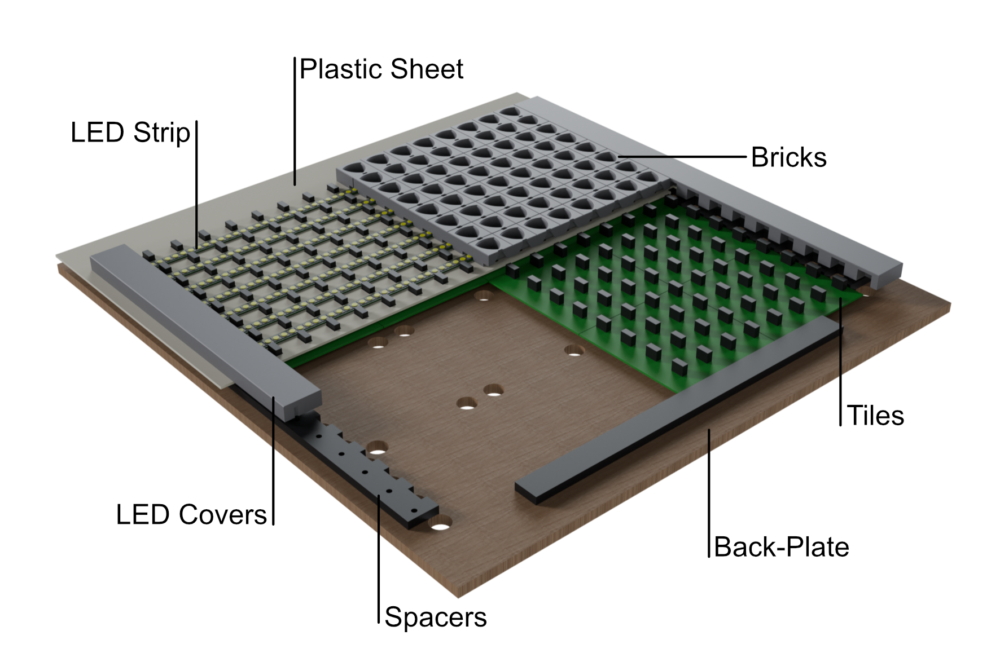

This folder contains all relevant STL files for both the proxies and the dashboard.

All files with the *model* -suffix in their name are just meant to help with planning and don't have to be printed.